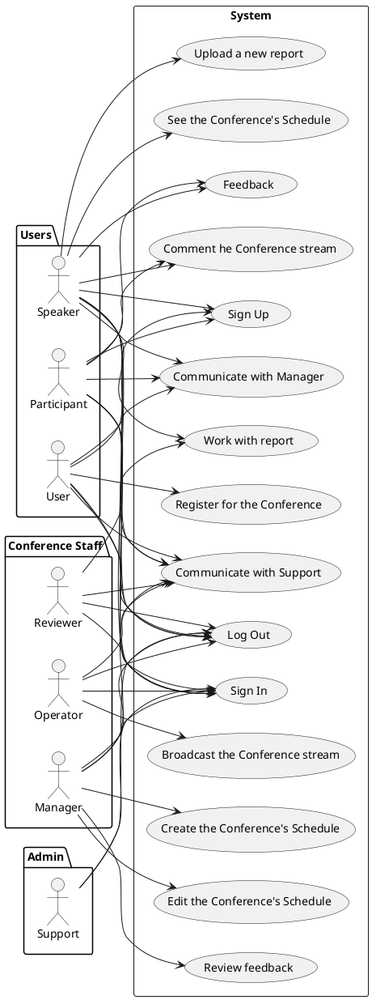

# Описание требований и архитектуры

## Введение
<!-- Общее краткое описание создаваемой системы -->
В рамках курса осуществляется проектирование решения на основе [постановки задачи от "заказчика"](../../task.md).

- [Описание требований и архитектуры](#описание-требований-и-архитектуры)
  - [Введение](#введение)
  - [Заинтересованные стороны](#заинтересованные-стороны)
  - [Бизнес-контекст (бизнес-требования)](#бизнес-контекст-бизнес-требования)
    - [Предпосылки (текущее состояние)](#предпосылки-текущее-состояние)
    - [Цели и задачи](#цели-и-задачи)
    - [Бизнес-цели и результаты](#бизнес-цели-и-результаты)
  - [Глоссарий](#глоссарий)
  - [Модель предметной области](#модель-предметной-области)
  - [Требования к системе](#требования-к-системе)
    - [Сценарии использования (Use case)](#сценарии-использования-use-case)
    - [Функциональные требования](#функциональные-требования)
    - [Нефункциональные требования/Требования к атрибутам качества](#нефункциональные-требованиятребования-к-атрибутам-качества)
    - [Ограничения](#ограничения)
  - [Архитектура](#архитектура)
    - [Журнал архитектурных решений](#журнал-архитектурных-решений)
    - [Контекст решения](#контекст-решения)
    - [Компонентная архитектура](#компонентная-архитектура)
    - [Реализация сценариев использования](#реализация-сценариев-использования)
    - [Программные интерфейсы](#программные-интерфейсы)
    - [Схема развертывания](#схема-развертывания)
  
## Заинтересованные стороны
<!-- Перечень заинтересованных сторон и их интересов по отношению к создаваемой системе. 
Подробнее: https://confluence.mts.ru/pages/viewpage.action?pageId=399975538 
-->
| Заинтересованная сторона | Интересы           |
|:-------------------------|:-------------------|
| Докладчики                | Подача доклада, замена доклада или подача исправленной версии доклада после рецензирования, общение с рецензентами, получение приглашения на конференцию, выступление на конференции, нетворк, получение подтверждения участия в конференции |
| Рецензенты                | Рецензирование доклада, общение с докладчиками, контроль качества и соответствия докладов нормативно-правовым актам РФ, тематике конференции и комплаенс компании ММ|
| Слушатели                 | Получение новой информации по заданной тематике, возможность задать вопрос докладчику,  получение приглашения на конференцию, нетворк |
| Менеджеры                 | Составление расписания конференции, работа с докладчиками, рецензентами, слушателями и партнерами, анализ обратной связи |
| Операторы                 | Проведение трансляции конференции |
| Техническая поддержка     | Помощь пользователям приложения в решении вопросов в части работы приложения |
| Провайдер | Предоставление интернет-ресурсов для передачи данных, привлечение новых пользователей |
| Компания ММ (топ-менеджмент) | Повышение квалификации сотрудников, рост конкурентоспособности (узнаваемости) компании, привлечение новых сотрудников и капитала, обмен опытом с представителями других компаний |
| Инвесторы               | Рост конкурентоспособности компании ММ, привлечение капитала |
| Регуляторы              | Проверка соответствия конференции, докладов и места проведения требованиям законодательства|
| Партнеры                | Предоставление территориальных и технических ресурсов для проведения конференции, рост конкурентоспособности (узнаваемости) компании, привлечение новых сотрудников и капитала, обмен опытом с представителями других компаний, создание партнерских отношений с компанией организатора конференции |

## Бизнес-контекст (бизнес-требования)
<!-- Общее описание бизнес-контекста создаваемой системы (автоматизируемой деятельности), список бизнес-целей заинтересованных сторон 
Подробнее: https://confluence.mts.ru/pages/viewpage.action?pageId=399973845
-->
### Предпосылки (текущее состояние)
Решили запустить конференцию [Hello, Conference!](helloconf.mts.ru) и столкнулись с огромным количеством желающих подать доклад.

Проблемы:
- Отсутствие собственного функционала для работы с докладчиками, слушателями, рецензентами и менеджерами.
- Сложность для докладчиков и рецензентов в работе с докладами по части прохождения процедуры рецензирования.
- Сложность для докладчиков и рецензентов в работе с обратной связью по предоставленным на рецензирование докладам.
- Сложность для менеджеров в работе с составлением расписания конференции.
- Отсутствие собственной независимой платформы для трансляции конференции. Ранее использовался YouTube.

### Цели и задачи
Повышение качества предоставляемых услуг путем разработки приложения для работы с докладами, расписаниями и проведением технических конференций МТС [Hello, Conference!](https://helloconf.mts.ru/).

### Бизнес-цели и результаты
Рост TRIM на 30%.

## Глоссарий
<!-- Содержит основные понятия и термины предметной области  
Подробнее: https://confluence.mts.ru/pages/viewpage.action?pageId=375782595
-->
| Понятие                        | Сокращение                         | Определение                       |
|:-------------------------------|:-----------------------------------|:----------------------------------|
| Докладчик | - | Пользователь, предоставляющий доклад на рецензирование и выступающий на конференции |
| Рецензент | - | Пользователь, проверяющий доклад Докладчика и предоставляющий обратную связь по нему |
| Доклад | - | Текстовый файл в формате .doc/.docx, первоначально предоставленный Докладчиком Рецензенту на рецензирование |
| Учетная запись | - | Запись, содержащая идентификационные данные, данные о роли пользователя в приложении |
| Страница приложения | - | Отдельное UI пространство приложения, предназначенное для реализации определенного бизнес- или технического процесса. Предусмотрены следующие страницы приложения: Доклады, Расписание, Трансляция, Личный кабинет, Sign In/Sign Up/Log out, Поддержка и т.д.|
| Менеджер | - | Пользователь, составляющий расписание конференции и анализирующий обратную связь участников после конференции |
| Участник | - | Физическое или юридическое лицо, принимающее участие в конференции в роли Докладчика или Слушателя |
| Слушатель | - | Пользователь, зарегистрированный на конференцию в качестве слушателя |
| Оператор | - | Пользователь, занимающийся настройкой и проведением трансляции конференции |
| Техническая поддержка | - | Пользователь, принимающий запросы от других пользователей приложения в части работы приложения и реагирующий на них в соответствии с установленным SLA |
| Компания Мой МТС | Компания ММ | Юридическое лицо, являющееся организатором конференции |
| Трансляция | - | Поток видео данных в режиме реального времени, предоставляемый Слушателям и Докладчикам |
| База данных приложения | БД | Упорядоченный набор структурированной информации и данных о пользователях приложения, конференции и докладах, которые хранятся в электронном виде |
| Recovery time objective | RTO | Период, в течение которого система может оставаться недоступной в случае аварии или сбоя |
| Комплекс технических средств | КТС | Комплекс, представляющий собой совокупность технических средств автоматизации, предназначенных для реализации технических систем |

## [Модель предметной области](data/data.md)

## Требования к системе

### Сценарии использования (Use case)
<!-- Подробное описание сценариев использования системы с привязкой к ролям участников и задействованным бизнес-сущностям 
https://confluence.mts.ru/pages/viewpage.action?pageId=375782108 
https://confluence.mts.ru/pages/viewpage.action?pageId=375782119 
-->
#### Диаграмма сценариев использования (Use Case Diagram) <!-- omit in toc -->

#### Список сценариев использования <!-- omit in toc -->

| ID     | Описание                                          |
|--------|---------------------------------------------------|
| UC.001 | *[Регистрация пользователя](uc/uc.001.md)* |
| UC.002 | *[Аутентификация пользователя](uc/uc.002.md)* |
| UC.003 | *[Регистрация на конференцию](uc/uc.003.md)* |
| UC.004 | *[Работа с докладом](uc/uc.004.md)* |
| UC.005 | *[Подача нового доклада](uc/uc.005.md)* |
| UC.006 | *[Создание расписания](uc/uc.006.md)* |
| UC.007 | *[Редактирование расписания](uc/uc.007.md)* |
| UC.008 | *[Проведение трансляции](uc/uc.008.md)* |
| UC.009 | *[Комментирование трансляции](uc/uc.009.md)* |
| UC.010 | *[Обратная связь по конференции](uc/uc.010.md)* |
| UC.011 | *[Коммуникация с Тех.поддержкой](uc/uc.011.md)* |
| UC.012 | *[Коммуникация с Менеджером](uc/uc.012.md)* |
| UC.013 | *[Просмотр расписания конференции](uc/uc.013.md)* |
| UC.014 | *[Выход из учетной записи пользователя](uc/uc.014.md)* |
| UC.015 | *[Анализ обратной связи](uc/uc.014.md)* |

### Функциональные требования
<!-- Описание требований к функциям, реализуемым системой. Требование может быть привязано к сценарию использования или быть общим 
Подробнее: https://confluence.mts.ru/pages/viewpage.action?pageId=375782501 
-->
| ID     | Функциональное требование             |
|--------|---------------------------------------|
| FR.001 | Пользователь должен иметь возможность загрузить файл доклада в формате .doc/.docx в систему во время регистрации на конференцию в роли **Докладчик** |
| FR.002 | Пользователь с ролью **Докладчик** должен иметь возможность общаться в назначенным ему системой пользователем с ролью **Рецензент** и наоборот |
| FR.003 | Пользователь с ролью **Рецензент** должен иметь возможность выгружать файл доклада в формате .doc/.docx в локальное хранилище |
| FR.004 | Пользователь с ролью **Рецензент** должен иметь возможность изменять статус доклада на **На рассмотрении**, **Отправлено на доработку**, **Принято** или **Отклонено** |
| FR.005 | Пользователь с ролью **Докладчик** должен иметь возможность загрузить обновленный файл доклада в формате .doc/.docx в систему при получении статуса доклада **Отправлено на доработку** |
| FR.006 | Пользователь с ролью **Докладчик** должен иметь возможность создать новую заявку на участие в конференции в роли **Докладчика** при получении по предыдущей заявке статуса **Отклонено** |
| FR.007 | Пользователь с ролью **Докладчик** должен иметь возможность создать только одну заявку на участие в конференции после получения по предыдущей заявке статуса **Отклонено** |
| FR.008 | Пользователь с ролью **Докладчик** не должен иметь возможность создать новую заявку на участие в конференции, если по текущей заявке статус доклада **Отправлено на рецензирование**, **На рассмотрении**, **Отправлено на доработку**, **Принято** |
| FR.009 | Пользователь с ролью **Менеджер** должен иметь возможность создавать расписание конференции |
| FR.010 | Пользователь с ролью **Менеджер** должен иметь возможность редактировать расписание конференции |
| FR.011 | Пользователь с ролью **Оператор** должен иметь возможность проводить трансляцию конференции |
| FR.012 | Пользователи с ролями **Докладчик** или **Слушатель** должны иметь возможность комментироать трансляцию |
| FR.013 | Система от лица пользователя с ролью **Менеджер** должна отправлять пользователя с ролями **Докладчик** или **Слушатель** опрос о конференции|
| FR.014 | Пользователи с ролями **Пользователь**, **Докладчик** или **Слушатель** должны иметь возможность общаться с пользователем с ролью **Менеджер** в **Чат с менеджером** |
| FR.015 | Пользователи с ролями **Пользователь**, **Докладчик**, **Слушатель**, **Рецензент**, **Оператор** или **Менеджер** должны иметь возможность обращаться к пользователям с ролью **Техническая поддержка** в **Поддержка** |
| FR.016 | Система должна блокировать общение между пользователями с ролями **Докладчик** и **Рецензент** при следующих статусах доклада: **Отправлено на рецензирование**, **Принято**, **Отклонено** |
| FR.017 | Система должна позволять пользователям с ролью **Пользователь** регистрироваться на конференцию |
| FR.018 | Через 10 дней после конференции система должна обновлять роли **Докладчик** и **Слушатель** на **Пользователь** |
| FR.019 | Через 10 дней после конференции система должна перенести все доклады в архив |
| FR.020 | Пользователи с ролью **Докладчик** должны иметь возможность видеть только свои доклады в разделе **Доклады**|
| FR.021 | Пользователи с ролью **Рецензент** должны иметь возможность видеть только назначенные им доклады в разделе **Доклады**|
| FR.022 | Доклады из архива не отображаются на Frontend|
| FR.023 | Пользователи должны иметь возможность зарегистрироваться на предстоящую конференцию за 10 дней (включительно) до даты конференции только в роли **Слушатель** |
| FR.024 | Пользователи, желающие выступить в роли **Докладчик**, должны иметь возможность зарегистрироваться на предстоящую конференцию за 20 дней (включительно) до даты конференции |
| FR.025 | Прошедшая конференция должна переноситься в архив через 10 дней после даты конференции |
| FR.026 | Конференции из архива не отображаются пользователям |
| FR.027 | Регистрация на предстоящую конференцию должна быть запрещена за 5 дней до даты начала конференции |
| FR.028 | Расписание прошедшей конференции должно переноситься в архив через 10 дней после даты конференции |
| FR.029 | Расписание прошедшей конференции из архива не отображается пользователя |
| FR.030 | Пользователи должны иметь возможность видеть расписание предстоящей конференции |
| FR.031 | Пользователи должны иметь возможность выходить из своей учетной записи |
| FR.032 | Пользователи с ролью **Менеджер** должны иметь возможность анализировать обратную связь от пользователей |

### Нефункциональные требования/Требования к атрибутам качества
<!-- Требования к основным архитектурным характеристикам (атрибутам качества) системы - надежность, масштабируемость, ИБ, и др.
Подробнее: https://confluence.mts.ru/pages/viewpage.action?pageId=375782530
-->
| ID     | Атрибут качества             | Описание требования                       | Алгоритм мониторинга                       |
|--------|------------------------------|-------------------------------------------|-------------------------------------------|
| AVL.001 | Доступность приложения не ниже 97% | Система должна быть доступна 97% времени. При этом время простоя не должно превышать 10,95 дней в год | Доступность = 100% * (время общей доступности - время простоя) / время общей доступности | 
| REL.001 | Надежность приложения не ниже 0,86 | Система должна обрабатывать не менее 98% обращений| Соотношение успешно обработанных запросов к общему числу запросов | 
| REL.002 | Целевое время восстановления (RTO КТС) 4 часа | RTO КТС - Максимальное время, в течение которого должно произойти восстановление работоспособности системы  | Потреченное время на восстановление = время восстановления работоспособности - время отказа системы | 
| SEC.001 | Аутентификация | Система должна быть защищена от несанкционированного доступа путем аутентификации по логину/паролю (локальная аутентификация). При регистрации система должна валидировать корректность введенного пользователем логина (адрес электронной почты) путем отправки пользователю по указанному адресу ссылки, по которой он должен перейти в течении 20 минут для подтверждения email. Запись о пользователе, не прошедшем валидацию, удаляется из БД. Пароль удовлетворяет следующим требованиям: не менее 8 символов и не более 128 символов; как минимум одна заглавная и одна строчная буква; только латинские буквы; как минимум одна цифра; только арабские цифры; без пробелов; другие допустимые символы: ~ ! ? @ # $ % ^ & * _ - + ( ) [ ] { } > < / \  " ' . , : ;. 1 пользователь = 1 связка логин/пароль | Проверка, что каждый пользователь имеет уникальную связку логин-пароль | 
| OBS.001 | Наблюдаемость | Система должна позволять проводить мониторинг времени, затраченного на рецензирование каждого доклада | Время получения докладом статуса accepted/rejected - Время первой подачи доклада| 
| CHM.001 | Поддержка версионности | Все компоненты системы должны поддерживать версионность. В записях БД должны содержаться дополнительные поля для предыдущих значений атрибута. При получении новых данных, старые данные должны перезаписываться текущими значениями | - |

### Ограничения
<!-- Описываются ограничения, оказывающие влияние на архитектуру системы - временные, финансовые, технологические
Подробнее: https://confluence.mts.ru/pages/viewpage.action?pageId=375782592
-->
| ID     | Ограничение            |
|--------|------------------------|
| AC.001 | *Описание ограничения* |

## Архитектура

### Журнал архитектурных решений
<!-- Записи о ключевых принятых архитектурных решениях (ADR) для реализации архитектурно-значимых требований.
Подробнее: https://confluence.mts.ru/pages/viewpage.action?pageId=421162308
-->
- [ADR.NNN Суть решения](adr/adr-template.md)

### [Контекст решения](context/context.md)

### [Компонентная архитектура](components/components.md)

### Реализация сценариев использования
<!-- Реализация сценариев использования на основе взаимодействия компонентов системы и внешних систем/участников.
Диаграммы последовательности (UML Sequence diagram) и текстовое описание.

Подробнее: 
https://confluence.mts.ru/pages/viewpage.action?pageId=399442132
https://confluence.mts.ru/pages/viewpage.action?pageId=399442170
-->
| ID     | Описание                          | Реализация                                    |
|--------|-----------------------------------|-----------------------------------------------|
| UC.001 | *Название сценария использования* | [Реализация сценария](uc-impl/uc.001-impl.md) |

### Программные интерфейсы
<!-- Спецификации публичных API системы и ее компонентов (синхронных, событийных). Создается на основе модели предметной области для реализации сценариев использования. 
  Форматы: OAS/Swagger, GraphQL, AsyncAPI/CloudEvents
-->
| Компонент             | Интерфейс                                      |
|:----------------------|:-----------------------------------------------|
| *Название компонента* | *[Название интерфейса](api/service-name.yaml)* |

### [Схема развертывания](deployment/deployment.md)
